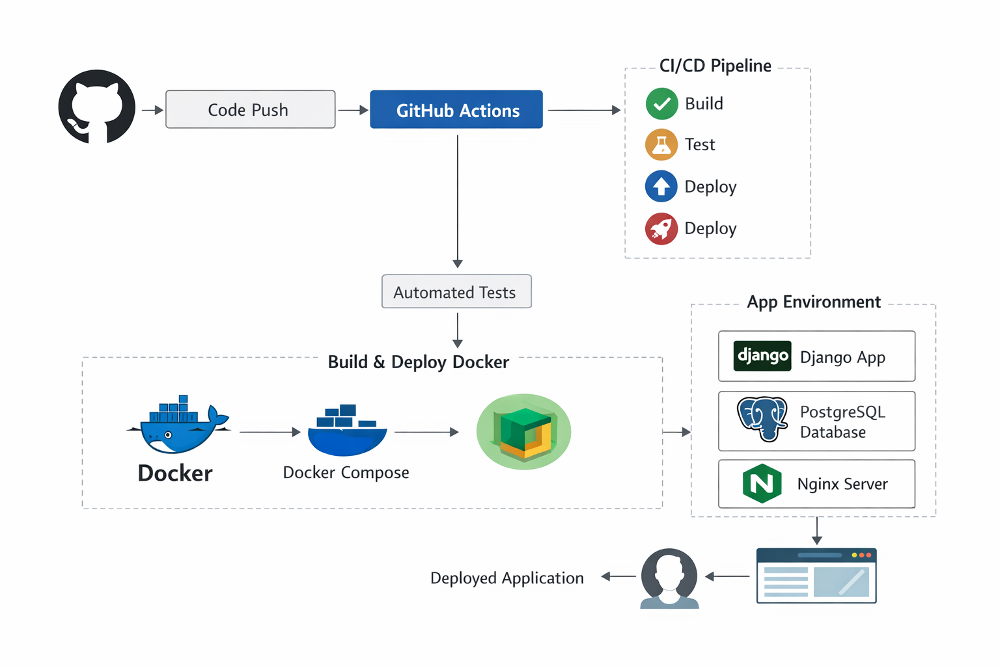

# 🚀 Django DevOps Starter Project


<p align="center">
<b>DevOps Project by MORELDEV237</b><br>
Docker • CI/CD • Django • Nginx • PostgreSQL
</p>

## Architecture DevOps



⚡ Where to find me

[](https://github.com/Moreldev237)
[](https://www.linkedin.com/in/morel-nkonga-5617a32a8/)
[](https://wa.me/+237686865451)

# 📌 Project Overview

This project demonstrates a **complete DevOps workflow for a Django application**.

The goal of this project is to practice and showcase essential DevOps skills:

- Containerization with **Docker**
- Multi-container orchestration with **Docker Compose**
- Continuous Integration / Continuous Deployment (**CI/CD**)
- Reverse proxy configuration with **Nginx**
- Production-ready Django deployment
- Cloud deployment ready

This project is part of my **DevOps learning journey**.


# 🧰 Tech Stack

- **Django**
- **Dockerfile**
- **Docker Compose**
- **PostgreSQL**
- **Nginx**

### Telecharger l'image 
```bash
docker push moreldev237/devops-project-1_web:latest
```

### Lancer l'application
```bash
docker run -p 8000:8000 moreldev237/devops-project-1_web:latest
```

### URL par defaut pour voir le projet apres avoir lancer
```bash
http://0.0.0.0:8000/hello/
```